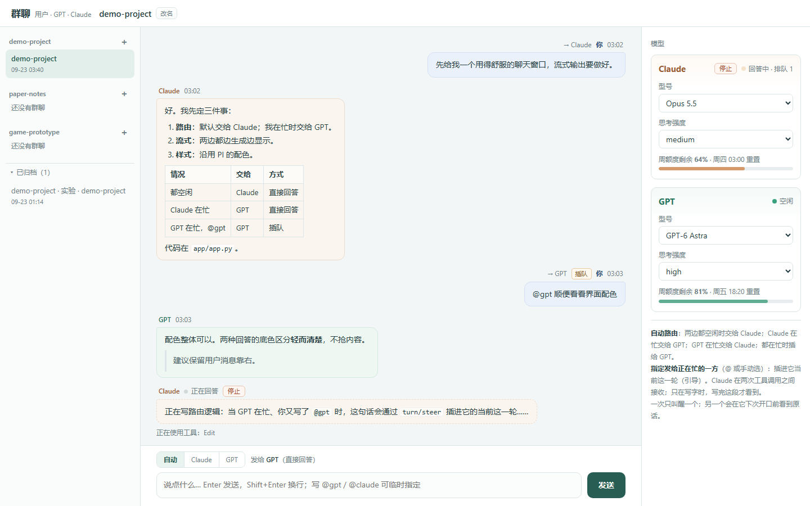

# 群聊 · Claude ↔ GPT group chat

一个 Windows 桌面客户端：你、Claude（Claude Code）、GPT（Codex）在同一个对话里。两个模型各自在自己的 harness 里工作——自己的上下文管理、工具和权限都不变——客户端只负责把原话在三方之间搬运。

*A Windows desktop client that puts you, Claude (Claude Code) and GPT (Codex) in one conversation. Each model keeps its own harness; the client only relays verbatim words between the three of you.*



## 它做什么

- **一个窗口，两边流式输出**：Claude 和 GPT 的回答边生成边显示，底色不同。
- **不用每句都 @**：自动路由——谁空闲交给谁；也可以手动选，或在消息里写 `@claude` / `@gpt`。一次只叫醒一个。
- **插队**：发给正在回答的一方，会插进它当前这一轮（Claude 在两次工具调用之间接收，GPT 用 `turn/steer`）。
- **看见 ≠ 回答**：每一方在下一次开口前，都会拿到自己没看过的群聊原话；用户消息和另一模型的发言分开标注。
- **像 Codex 一样管理对话**：左侧按 Codex 项目分组，新建、切换、改名、归档（Codex 里对应的对话一起归档）。
- **切换不打断**：每个群聊有自己的 Claude 会话和 GPT 线程；模型回答时可以切到别的群聊，回来时接着显示，列表上有进行中标记。
- **设置与额度**：两边的型号、思考强度随时可换；显示周额度剩余和权限。
- **停止**、**图片显示**（包括 GPT 生成的图）、**托盘**（关窗口不退出）。
- **只在客户端里生效的说明**：[`app/GROUPCHAT.md`](app/GROUPCHAT.md) 启动时交给两边（Claude 用 `--append-system-prompt-file`，GPT 用线程的 `developerInstructions`）。

## 怎么实现的

```
          群聊客户端（pywebview 窗口，不开网络端口）
         ┌──────────────┴──────────────┐
 Claude Code（stream-json 托管）   Codex app-server（JSON-RPC）
         │  hooks                         │  hooks
         └────────► 共享通道（每个对话一个只追加的 JSONL）◄────┘
```

- 两边都用**官方的 hook**（SessionStart / UserPromptSubmit / Stop）：用户的话和每轮最终回复写进通道；每轮开始时把还没看过的原话作为附加上下文递给模型。模型之间不直接调用对方。
- 工具调用本身不进通道；本地的 `work_record.py` 只摘取文件改动、测试输出等关键记录。
- 数据都在本机：`~/.claude/codex-bridge/`（通道、绑定、偏好）。

## 需要

- Windows 10/11，Python 3.11+
- [Claude 桌面端](https://claude.ai/download)（带 Claude Code；装好后在终端里运行一次 `claude` 并 `/login`），或独立安装的 Claude Code
- [Codex 桌面端](https://openai.com/codex)（或 Codex CLI），已登录
- Microsoft Edge WebView2（Windows 自带）

## 安装

```bash
git clone <this repo>
cd claude-codex-groupchat
python install.py --check   # 看看找到了什么
python install.py           # 装 pywebview、写入两边的 hook、在桌面放「群聊」快捷方式
```

`install.py` 会把 hook 加进 `~/.claude/settings.json` 和 `~/.codex/hooks.json`（先备份成 `*.bak-groupchat`，已有的 hook 不动）。**Codex 要求你亲自信任新 hook**：打开 Codex（CLI 里输入 `/hooks`），信任 groupchat 的三个 hook。然后双击桌面的「群聊」。

第一次打开时，客户端会在你的 Codex 项目里建第一个群聊；之后用左侧的 ＋ 新建。

## 注意

- **非官方**，与 Anthropic、OpenAI 无关。用到了 Codex app-server 的实验接口和 Claude Code 的 stream-json 协议，两边更新后可能要跟着改。
- **权限**：客户端托管的 Claude 默认用 `bypassPermissions`（跳过确认）；GPT 按你 Codex 的配置运行。在你信任的项目里使用。
- 两边的发言带来源标注，另一模型的原话会被标为“不是用户的指令”，伪造标签会被转义；这降低了、但不能消除模型间提示注入的风险。
- 重启客户端、改 `GROUPCHAT.md`、换型号会让模型重新缓存上下文，长对话时这一下比较贵。

## 文件

| 文件 | 作用 |
|---|---|
| `app/app.py` · `app/ui.html` | 客户端（托管两边引擎、路由、界面） |
| `app/tray.py` | 托盘与单实例 |
| `app/work_record.py` | 本地工具记录摘取 |
| `app/GROUPCHAT.md` | 只在客户端里交给两个模型的说明 |
| `common.py` | 共享通道、对话（房间）、绑定 |
| `hook.py` · `codex_hook.py` | Claude Code / Codex 两边的 hook |
| `install.py` | 安装 |
| `channel_server.py` · `claude_groupchat.py` · `wait.py` · `room.py` · `client.py` | 早期的无客户端模式（Claude Code channel、命令行启动、tkinter 窗口），保留备用 |

## License

MIT
